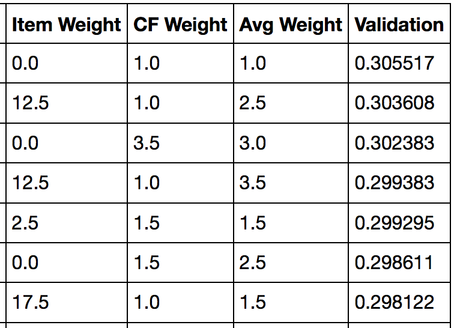

# MeepleFinder
Board game recommender system to find new board games! Meeple Finder is up and running. Check it out at www.meepleboardgamefinder.com

## Business Understanding
Whether you are into board games or not, board gaming is a growing industry with nearly $1.2 billion in sales in 2015 in the U.S. and Canada alone (https://icv2.com/articles/news/view/35150/hobby-games-market-nearly-1-2-billion).
Also, new board games are being produced every week  making it hard to stay on top of what's available. Lastly, board games are expensive and bulky, so when you do but a new board game, you want to make sure it's the right one. This is where Meeple Finder comes in.

## Data Understanding
The data I collected was from boardgamegeek.com. I scraped data for over 13,000 board games with such information as complexity, mechanisms, publishers, etc. I also collected user ratings data for every user in the state of Washington, about 1200 users.

## Data Preparation
The board game data needed a lot of cleaning before it was ready to be converted into a similarity matrix. Some of the information was numerical, but the columns for designers, publishers, mechanics, and a few others needed to be converted into dummy variables. Once the data preparation was done, I was left with about 3300 columns to compare between board games. The ratings data was much easier to work with, but since I was using Spark's ALS model, the data (names of users and board games) needed to be converted into integers rather than strings. This was done using a python dictionary for easy converting.

## Modeling
+ Collaborative Filtering: Spark’s Alternating Least Squares using ratings data from every user in WA
+ Content-Based: A board game - board game cosine similarity matrix was created using a number of features (complexity, max play time, mechanics, etc.)
+ The final model used both of these as well as the average ratings of the board games. Weights for each aspect of the model were determined during the evaluation process.

## Evaluation
For the evaluation process, I tried to mimic what the model was doing as much as possible. I did a grid search altering all three weights used in the model as well as the number of users that each new user is compared to.

First, I held out 70 users from my training dataset. Then, for each user in the test set, I took the user's top 3 games and created a new array where these 3 games had a rating of 10 out of 10. I then do a cosine similarity with every user in the training set to find the top users that the new array best matches and average the ratings of those users from the Spark ALS transform method. Next, I average together the 3 similarity arrays collected from the board game - board game cosine similarity matrix. And finally, I add these 2 arrays to the array of average ratings for each board game and return the top 20 games. The ratings for these games by the user were averaged together to get the validation score. This process was repeated for every user in the test set for every combination of weights.

Here are some of the results:

As you can see from the chart above, The evaluation process gave me mixed results. In particular, I noticed that I got similar results whether or not I included the similarity matrix (Item Weight). After making some comparisons between various weights on the web app for particular games and seeing what was recommended, I decided to keep the similarity matrix in the model because it resulted in more interesting results.

## Deployment
The model was implemented using a web app which is currently up and running at www.meepleboardgamefinder.com. While it is up and running, however, there are still a few modifications that I would like to make before final deployment.
1. I have ratings data for the rest of the users in the U.S. that I would like to incorporate into the model, but I haven't yet figured out how to do so without slowing down the web app significantly.
2. Add a "New to board gaming" feature to the web app that will allow people who are completely new to board games to use it.
3. Add an NLP component to the model using game description data to assist in the classification of different board games.
